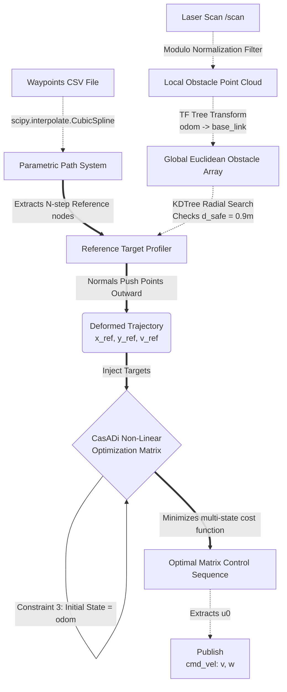

# Optimization-Based Model Predictive Control (MPC) Navigation

This document provides a comprehensive technical breakdown of the architectural evolution, mathematical implementations, and control theory workflows that transitioned this project from a standard Regulated Pure Pursuit tracker into a robust, predictive, CasADi-backed Model Predictive Control system.

---

## 1. The Core Limitation: Why Abandon Pure Pursuit?
Classic Pure Pursuit operates on a reactive, geometric heuristic: it draws an arc to a single "lookahead" point sitting exactly $L$ meters down the path. 
- **The flaw:** It fundamentally lacks temporal awareness. It cannot "plan" for tight corners coming up after the lookahead point, nor does it organically negotiate obstacles because its sole mathematical constraint is the single arc equation. 
- **The solution:** Model Predictive Control (MPC) analyzes an $N$-step horizon ($15$ steps into the future). By factoring in the physical kinematic limits of the robot (max velocity, acceleration, turning radius) simultaneously across all $15$ future states, it creates globally optimal, fluid steering profiles that prepare for curves before physically entering them.

---

## 2. Evolution of the Custom MPC Algorithm

Our algorithm underwent several structural iterations to conquer Gazebo simulation anomalies and kinematic limitations.

### A. Mathematical Formulation
We deployed the **IPOPT Non-Linear Solver (via CasADi)** to solve the discrete unicycle kinematic model:
*   $X_{k+1} = X_k + v_k \cos(\theta_k) dt$
*   $Y_{k+1} = Y_k + v_k \sin(\theta_k) dt$
*   $\theta_{k+1} = \theta_k + \omega_k dt$

The cost function matrices ($Q$ and $R$) were heavily tuned to relax the heading penalty ($Q_\theta$) while enforcing tight spatial tracking ($Q_{x,y}$). This allows the robot to aggressively "crab-walk" or weave if its position varies, rather than strictly preserving an incorrect heading.

### B. Trajectory Deformation (The Swerve Mechanism)
Instead of forcing the MPC matrix to navigate hard impenetrable constraints (which mathematically paralyzes solvers causing computational lag), we implemented a **Dynamic Geometric Sweeper**.
1. We lock the robot's target spline and evaluate it $15$ steps forward.
2. If the LiDAR maps an object within $0.9m$ of a future point, we calculate the continuous path tangent at that precise point.
3. We generate a 90-degree lateral Normal Vector pointing away from the object, and deliberately shift the reference point (`x_ref`, `y_ref`) outward by safety scalar $D$.
4. **Result:** The solver organically pulls the robot along a dynamically generated bypass curve!

### C. The LiDAR Sensor Blindspot Bug
A critical failure was discovered where the robot would effortlessly dodge left-sided objects, but reliably smash into right-sided ones without braking. 
*   **The Cause:** Gazebo's simulated Hokuyo LiDAR natively indexes arrays from $0$ to $2\pi$. The collision bounding box checked `[-1.0, 1.0]` radians. While this caught left-side objects ($0 \to 1.0$), right side objects appeared mathematically as $5.2$ radians ($300^\circ$), invisibly slipping past the filter.
*   **The Fix:** We injected geometric modulo normalization `(angle + \pi) \% (2\pi) - \pi` directly above the KDTree layer to wrangle the laser scope symmetrically into `[-180, +180]`.

### D. Kinematic Safety Brakes
To afford the solver enough physical time to negotiate obstacles, we scale the reference velocity down severely when objects penetrate the safety envelope. However, if an object immediately breaches the `0.20m` physical chassis radius, an emergency heuristic bypasses the MPC entirely and zeroes the wheel velocities, actively acting as a physical bumper killswitch.

---

## 3. MPC Pipeline Workflow

Below is the complete architectural data flowchart bridging the `.csv` maps to the physical wheel torque.

## Summary
By detaching the obstacle-avoidance geometry from the heavy CasADi non-linear constraints, and migrating the entire structure seamlessly into a pristine python `mpc_nav` environment, the vehicle effortlessly achieves continuous, forward-thinking trajectory blending.
